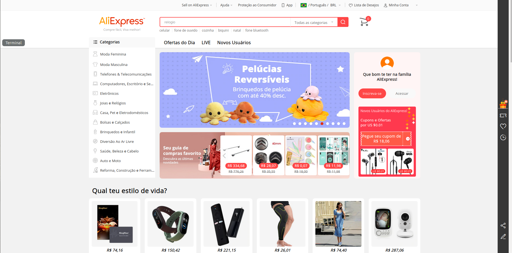
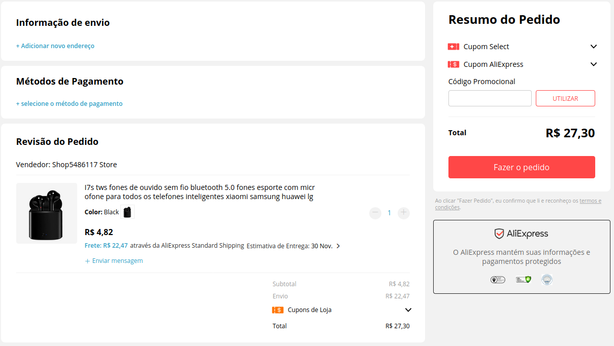

# Avaliação do Teste Piloto

## Introdução

A avaliação do teste piloto trata da compreensão prévia a ser feita antes de se aplicado nos usuários, ela serve para que os avaliadores compreendam os procedimentos que deverão ser avaliados assim como o que se espera que o usuário desenvolva durante o momento em que se aplicará a avaliação de fato. Ela corresponde ao conjunto das avaliações feitas anteriormente sendo a avaliação da análise de tarefas e do storyboard, verificando se as tarefas nessas avaliadas de fato atingem os objetivos estabelecidos pelas avaliações.

No teste piloto inicial usaremos personas para estabelecer o papel dos usuários na utilização do site.

## Objetivos

O objetivo do documento é detalhar a forma como o teste piloto deverá ser aplicado, bem como as instruções que deverão ser seguidas pelos avaliadores quando aplicado em usuários reais.

## Metodologia

Por se tratar de um teste piloto "documental" não empregado nenhuma metodologia específica, sendo postergada para a utilização prática dos protótipos de baixa e alta fidelidade.

## Termo de Consentimento
Antes da avaliação é mostrado ao usuário um termo de consentimento, instruíndo-o sobre como será feita a avaliação bem como os objetivos e finalidades do projeto em si, lembrando ao usuário que há a possibilidade de desistêcia a qualquer momento durante a realização das atividadee. Abaixo o Termo de Consetimento:

[Termo de Consentimento](./images/TermodeConsetimento.pdf)

## Avaliação

### 1. Escolha das tarefas a serem desenvolvidas

Para a escolha das tarefas, foi baseada nas funcionalidade mais utilizadas no site para que dessa forma possam ser identificados problemas iniciais a serem tratados no protótipo de baixa fidelidade

A escolha das funcionalidades foram:

- Login;
- Pesquisa por produto na barra de pesquisa;
- Compra;

### 2. Login no site

Como foi estabelecido na análise de tarefas é importante demonstrar que existe a possibilidade de cadastro e de login no site, por ambas as funcionalidades serem semelhantes, serão deixados imagens para facilitar para o avaliador compreender na hora de instruir os usuários.

|***Figura 1 - Cadastro***|***Figura 2 - Login(Entrar)***|
|:-:|:-:|
|||

Percebe-se que o cadastro assim como o login dispõe da capacidade de se cadastrar ou entrar, caso cadastrado com aquela conta, com contas vinculadas de outros sites, é importante que o avaliador disponha dessa opção para os usuários e explique de que forma isso os afeta. 

Etapas a serem seguidas pelo usuário que deverão ser instruídas pelo avaliador.

Cadastro/Login:

1. Peça para que o usuário se cadastre usando um e-mail e senha fornecidos pelo avaliador;

2. Peça para que o usuário confirme o e-mail cadastrado;

3. Após ter a confirmação de acesso ao site, peça para que o usuário faça login no site;

### 3. Busca na barra de pesquisa

Essa etapa estabelece que produtos os usuários deverão pesquisar, e de que forma os usuários serão impactados, nessa funcionalidade somos capazes de notar algumas características definidas pelas metas de usabilidade que estabelecem o tempo de resposta da página ao usuário. As imagens a seguir foram escolhidas com base no perfil do usuário feito anteriormente, serão 4 imagens representando os produtos, disponibilizados no site, mais comprados pelos usuários pesquisados bem como a imagens na barra de pesquisas.

***Figura 3 - Barra de Pesquisa***

***Figura 4 - Barra de Pesquisa(em evidência)***

 

|***Figura 5 - Eletrônicos***|***Figura 6 - Eletrônicos***|
|:-:|:-:|
|||

|***Figura 7 - Roupas***|***Figura 8 - Maquiagem***|
|:-:|:-:|
|||

Etapas a serem seguidas pelo usuário que deverão ser instruídas pelo avaliador.

Pesquisa de um produto:

1. Demonstre ao usuário através das imagens disponibilizadas a barra de pesquisa do site;

2. Forneça ao usuário as imagens dos produtos que ele terá que achar no site;

3. Especifique as categorias de cada produto;

4. Faça a avaliação de um produto por vez, sempre regressando a página principal do site para pesquisar um novo produto.

### 4. Compra de um produto

Essa etapa se baseia na capacidade de avaliar se o usuário consegue de forma intuitiva comprar um produto, a compra não será finalizada, será apenas avaliado se a funcionalidade comprar apresenta algum desafio a um usuário "novo" bem como se há algum erro ou problema durante a execução da tarefa. Para trabalhar junto das outras avaliações feitas essa etapa terá as tarefas desenvolvidas anteriormente, o avaliador responsável deverá verificar se o usuário possui a noção intuitiva de realizar as tarefas novamente, bem como avaliar se o site possui uma fácil aprendizagem de suas funções básicas. Abaixo a imagem da etapa de compra que o usuário deve alcançar durante a avaliação.

Etapas a serem seguidas pelo usuário que deverão ser instruídas pelo avaliador.

1. O avaliador deve explicar a etapa de compra, dando o foco de que o usuário não precisará comprar nada, apenas deve chegar a etapa de compra do site;

2. O avaliador selecionará um produto já mostrado anteriormente para o usuário, que deverá ser comprado;

3. O avaliador deve escolher qual dos dois caminhos o usuário irá percorrer, sendo eles:
    - Comprar sem se logar anteriormente;
    - Comprar já com logado ao site;

4. Com o caminho escolhido o usuário deve chegar ao produto utilizando da barra de pesquisa;

5. Achando o produto da imagem o usuário deve ir para a etapa de compra daquele produto, quando o usuário tiver sucesso nessa tarefa, o avaliador deve instruí-lo sobre o fim do teste.

### Definição dos participantes

Com o processo de avaliação já estabelecido, é necessário escolher quem poderá participar do teste piloto, é importante detalhar que o teste não pode ser feito por qualquer um, ele deve seguir o perfil do usuário que foi pesquisado e documentado anteriormente, dessa forma tem-se uma limitação na hora de selecionar possíveis candidatos ao teste. Com base no perfil do usuário, estão sucetíveis a fazer o teste, usuários com as características abaixo:

#### Público universitário

- Preferencialmente do sexo masculino;
- Idade entre 18-22 anos;
- Ainda estar cursando a graduação;

#### Público Geral

- Preferencialmente do sexo feminino
- Idade entre 23-26 anos;
- Independente financeiramente;
- Empregado(a) ou cursando ensino superior;

Os dados acima foram retirados dos perfis desenvolvidos de cada público feitos pela análise do perfil do usuário, caso deseje acessar os dados, basta acessar o [Perfil do Usuário](./././requirementsAnalysis/userProfile/userProfile)

### Personas
Abaixo algumas personas que servem como uma referência para escolher o usuário a ser avaliado

|Foto|Informações básicas|
|:-|:-|
|| <ul><li><b>Nome:</b> Mario Moacir</li><li><b>Idade:</b> 22 anos</li><li><b>Profissão:</b> Estudante</li><li><b>Educação:</b> Ensino superior incompleto</li></ul> |

|Foto|Informações básicas|
|:-|:-|
|| <ul><li><b>Nome:</b> Verônica Rocha</li><li><b>Idade:</b> 25 anos</li><li><b>Profissão:</b> Contadora</li><li><b>Educação:</b> Mestrado completo</li></ul> |

 

### Execução do Teste Piloto

Com a avaliação montada, e com a definição de quais pessoas deverão participar da avaliação, é necessário descrever como será feito a avaliação pelos avaliadores, serão listados as etapas bem como quais observações o avaliador deve ter durante cada uma delas.

Etapas:

1. Fornecer ao usuário o Termo de Consentimento, que informa a finalidade daquele teste, a garantida de privacidade das informações do usuário, bem como a possibilidade de desistência do teste caso o usuário não se sinta apto, ou confortável o suficiente para dar continuidade à avaliação;

2. Pegar as informações do usuário;

3. Começar as etapas da avaliação, descritas na parte de Avaliação;

4. Finalizar o teste e agradecer a participação do usuário;

Para que o avaliador consiga anotar suas observações assim como problemas tanto do site, quanto do usuário em relação às tarefas foi desenvolvido uma tabela para que o mesmo possa descrever todo o processo. Disponível para download abaixo.

[Avaliação do Teste Piloto.pdf](./images/AvaliaçãodoTestePiloto.pdf)

[Avaliação do Teste Piloto.docx](./images/AvaliaçãodoTestePiloto.docx)

### Conclusão

Ao final do processo de avaliação o avaliador deverá ,juntamente da planilha feita durante o processo do teste, escrever um relatório em relação a avaliação feita pelo mesmo, bem como a abordagem da escolha na etapa 3, e por fim os resultados obtidos. 

 

## Versionamento

|Data|Versão|Descrição|Autor|
|:-:|:-:|:-:|:-:|
|27/10/2020|0.1|Criação do documento| Pedro Vítor de Salles Cella|
|28/10/2020|0.2|Atualização do documento| Pedro Vítor de Salles Cella|
|28/10/2020|0.3|Revisão e correção| Ailamar Alves |

 

## Referências

- BARBOSA, S.D.J.; SILVA, B.S. Interação Humano--Computador. Computador. Editora Campus -- ElsevierElsevier, 2010., 2010.INF 1403 INF 1403 -- Introdução a IHC Introdução a IHC @Prof. Alberto Barbosa Raposo@Prof. Alberto Barbosa Raposo.
