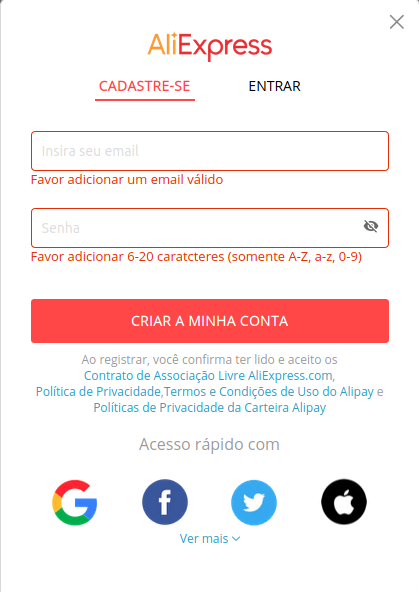

# Avaliação do Teste Piloto

### Introdução
A avaliação do teste piloto trata da compreensão prévia a ser feita antes de se aplicado nos usuários, ela serve para que os avaliadores compreendam os procedimentos que deverão ser avaliados assim como o que se espera que o usuário desenvolva durante o momento em que se aplicará a avaliação de fato. Ela corresponde ao conjunto das avaliações feitas anteriormente sendo a avaliação da análise de tarefas e do storyboard, verificando se as tarefas nessas avaliadas de fato atingem os objetivos estabelecidos pelas avaliações.

No teste piloto inicial usaremos personas para estabelecer o papel dos usuários na utilização do site.

### Objetivos
O objetivo do documento é detalhar a forma como o teste piloto deverá ser aplicado, bem como as instruções que deverão ser seguidas pelos avaliadores quando aplicado em usuários reais.

### Metodologia
Por se tratar de um teste piloto "documental" não empregado nenhuma metodologia específica, sendo postergada para a utilização prática dos protótipos de baixa e alta fidelidade.

### Avaliação
#### 1. Escolha das tarefas a serem desenvolvidas
Para a escolha das tarefas, foi baseada nas funcionalidade mais utilizadas no site para que dessa forma possam ser identificados problemas iniciais a serem tratados no protótipo de baixa fidelidade

A escolha das funcionalidades foram:
- Login;
- Pesquisa por produto na barra de pesquisa;
- Compra;

### 2. Login no site
Como foi estabelecido na análise de tarefas é importante demonstrar que existe a possibilidade de cadastro e de login no site, por ambas as funcionalides serem semelhantes, serão deixados imagens para facilitar para o avaliador compreender na hora de instruir os usuários.

***Figura 1 - Cadastro***

***Figura 2 - Login(Entrar)***

Percebe-se que o cadastro assim como o login dispõe da capacidade de se cadastrar ou entrar, caso cadastrado com aquela conta, com contas vinculadas de outros sites, é importante que o avaliador disponha dessa opção para os usuários e explique de que forma isso os afeta. 

### 3. Busca na barra de pesquisa
Essa etapa estabelece que produtos os usuários deverão pesquisar, e de que forma os usuários serão inpactados, nessa funcionalidade somos capazes de notar algumas características definidas pelas metas de usabilidade que estabelecem o tempo de resposta da página ao usuário. As imagens a seguir foram escolhidas com base no perfil do usuário feito anteriormente, serão 3 imagens representado produtos mais comprados pelos usuários pesquisados bem como a imagens na barra de pesquisas e dos mesmos produtos disponibilizados no site.

***Figura 3 - Barra de Pesquisa***

***Figura 4 - Barra de Pesquisa(em evidência)***

***Figura 5 - Smartwatch***

