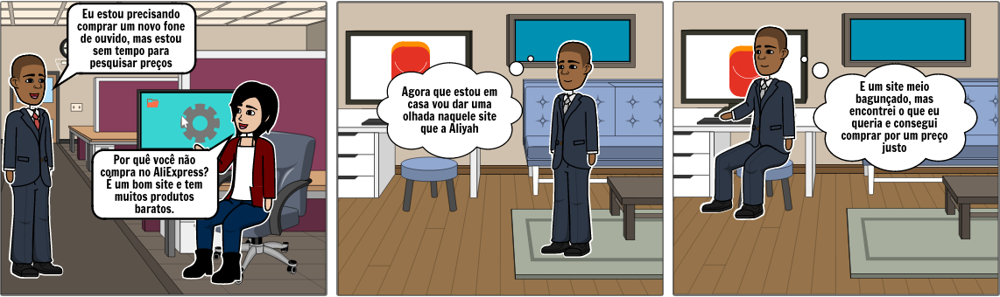
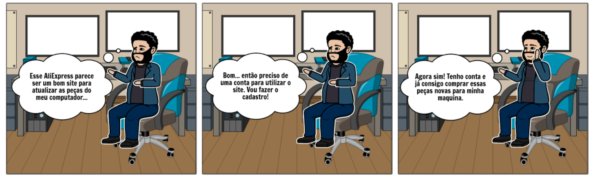
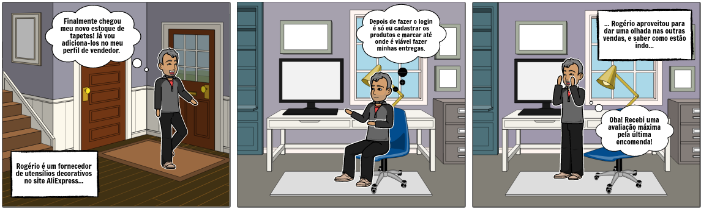

# Planejamento da avaliação do Storyboard

## Introdução
A avaliação do Storyboard consiste na análise do storyboard da equipe, feito por um usuário ela se baseia em relatar se o mesmo abordou de forma significativa os problemas existentes no site, esses problemas são caracterizados através de figuras evidenciando as 3 principais funcionalidades, ou seja, o cadastro, a compra e a venda de um produto, dessa forma o storyboard cria possíveis situações de dificuldade que os usuários podem passar, por isso é feito tal avaliação, para entender, através de um usuário real, se aquelas situações representadas são de fato problemas reais que os usuários podem vir a ter ou que já passaram por elas.  

## Objetivos
O objetivo desse planejamento é direcionar o avaliador na hora da aplicação dessa entrevista, ele visa ajudar nas tarefas que o mesmo deverá desempenhar, assim como quais perguntas deverão ser feitas, e qual é o resultado esperado, dessa forma poderá ser avaliado o storyboard. O objetivo principal é determinar se os storyboards desenvolvidos pela equipe fazem uma representação fiel e satisfatória dos problemas enfrentados pelos usuários na hora de realizar qualquer uma das 3 tarefas principais do AliExpress. 

## Metodologia
A aplicação da avaliação usará duas metodologias, sendo elas a entrevista, que será a ferramenta principal para a captação de informações de usuáros reais, bem como a utilização de personas, visto a situação atual de pandemia vivida pelo mundo, é necessário estabelecer uma saída alternativa caso não seja possível aplicar a avaliação em usuários reais.

## Termo de Consentimento
Antes da avaliação é mostrado ao usuário um termo de consentimento, instruíndo-o sobre como será feita a avaliação bem como os objetivos e finalidades do projeto em si, lembrando ao usuário que há a possibilidade de desistêcia a qualquer momento durante a realização das atividadee. Abaixo o Termo de Consetimento:

[Termo de Consentimento](https://docs.google.com/document/d/1OK_upZJjwvDixhqOPLErghCdlKtA7kdCviEqBe4iEQ4/edit?usp=sharing':target=_blank')

## Avaliação
A avaliação será realizada com base nos 3 storyboards da equipe, seŕa mostrado um storyboard por fez, e a partir dele serão realizados algumas pergunta para captar o máximo de informações, evidenciando que essa avaliação deve ser feita depois do teste piloto, para que o usuário já tenha noção das funcionalidade do site e seus problemas.

### Storyboards

### SB01 - Fluxo de Compras

#### Perguntas a serem feitas sobre o storyboard:
1. 

### SB02 - Fluxo de *Login*

#### Perguntas a serem feitas sobre o storyboard:
1. 

### SB03 - Fluxo de Vendas

#### Perguntas a serem feitas sobre o storyboard:
1. 

 

### Definição dos participantes
A escolha dos participantes se baseia no teste piloto feito anteriormente, o ideal é trabalhar com os memos usuários que realizaram o teste piloto anteriormente, caso não seja possível, seguir o padrão cobrado no teste piloto.

[Definição dos participantes - Teste Piloto](https://interacao-humano-computador.github.io/2020.1-AliExpress/#/pages/design_avaliation_development/pilotTestAvaliation/pilotTestAvaliation?id=defini%c3%a7%c3%a3o-dos-participantes)

### Execução do Storyboard
Com a avaliação montada, o avaliador seguirá etapas para aplicar essa avaliação, é importante relatar que o mesmo deverá utilizar de um documento previamente feito para anotar as respostas do participante, bem como para anotar suas próprias conclusões à cerca dos resultados dos storyboards. 

Abaixo o documento disponível para visualização:

[Avaliação do Storyboard em docx](https://docs.google.com/document/d/13m9VW4xRerNq1DXl7VVzMSDOPuLElFamveQ5nfMqb4E/edit?usp=sharing ':target=_blank')

Etapas a serem seguidas:

1. O avalidor deverá mostra os storyboards para o participante ter a noção da quantos serão avaliados;

2. O avaliador vai passar um de cada vez, realizando as perguntas escritas anteriormente, o mesmo deverá anotar as respostas do documento de avaliação.

3. Ai fim da entrevista o avaliador devrá agradecer o participante, e anotar as conclusões e resultados da avaliação no documento.

### Conclusão
Com o documento já preenchido, deverá ser levado à equipe os problemas apresentados para que haja uma modificação de correção.

## Versionamento

|Data|Versão|Descrição|Autor|
|:-:|:-:|:-:|:-:|
|27/10/2020|0.1|Criação do documento| Pedro Vítor de Salles Cella|

## Referências

- BARBOSA, S.D.J.; SILVA, B.S. Interação Humano--Computador. Computador. Editora Campus -- ElsevierElsevier, 2010., 2010.INF 1403 INF 1403 -- Introdução a IHC Introdução a IHC @Prof. Alberto Barbosa Raposo@Prof. Alberto Barbosa Raposo.