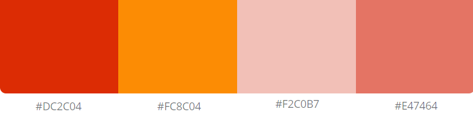
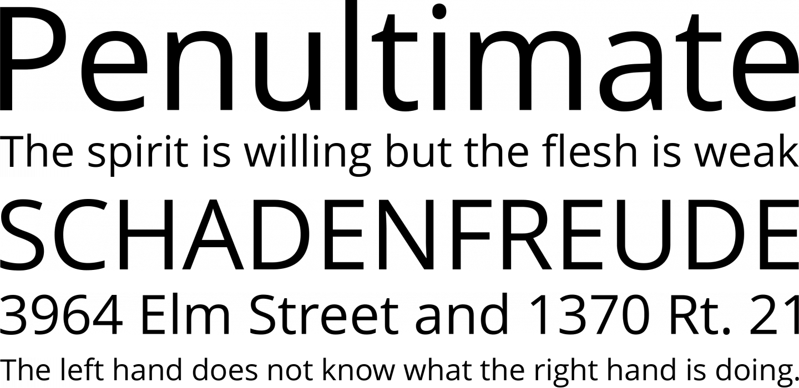
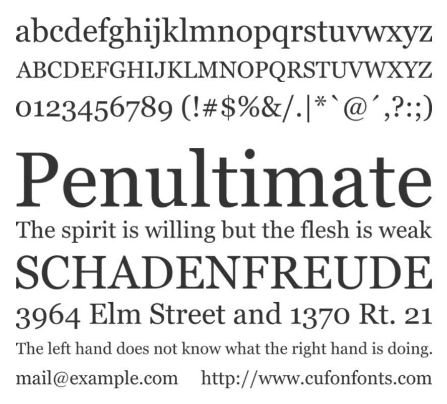
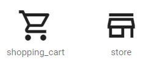

# Guia de estilos

## Introdução

O guia de estilos é um registro das principais decisões de design tomadas, de forma que elas não se percam, isto é, sejam efetivamente incorporadas no produto final.

## Metodologia

Para o desenvolvimento do um guia de estilo devemos incorporar as decisões que envolvem os principais elementos e considerações de design de interface como layout, design gráfico, tipografia, simbolismo, cores, design de telas, elementos de interface entre outros. De acordo com o site AliExpress levantamos alguns desses elementos. 

## Resultados de análises

O Ali Express é um site de varejo, do grupo Alibaba, maior grupo de varejo do mundo, com sede na China e bastante conhecido por vender diversos produtos com preços mais acessíveis. A partir dessas informações, conseguimos desenvolver o guia de estilo para o nosso projeto.

## Elementos de interface

### Logo

A imagem abaixo representa a logo atual bem conhecida e utilizaada nos sites da AliExpress.  
Essa logo por já ser bastante minimalista e difundida na internet, não sofrerá nenhuma mudança em seu visual para não perder a identidade do site.

    *Fig1:Logo AliExpress.*

### Paleta de cores

  *Fig2:Paleta de cores AliExpress.*

Para cor do fundo iremos utilizar **#FFFFFF** (100% Branco), como contraste do fundo **#F1F1F1** (Cinza claro) e a cor da fonte e dos símbolos será **#333333**. As cores da paleta possuem diferentes tons de vermelho, o que remete a promoções e preços mais baixos, que acontecem no site com bastante frequência.

### Tipografia

A fonte padrão encontrada no site é a **Open Sans**, uma fonte humanista projetada com formas abertas e uma aparência neutra. Ela foi otimizada para interfaces de impressão, web e móveis, e possui excelentes características de legibilidade em seus formatos de letras.  

 *Fig3:Tipologia fonte Open Sans.*

Entretanto para o desenvolvimento do nossa tipografia, a fonte utilizada será a **Georgia**. A **Georgia** é uma fonte que possui personalidade distinta e é visualizada com nitidez na tela, por esses motivos é mais recomendada para sites de varejo.

 *Fig4:Tipologia fonte Georgia.*

### Símbolos não tipográficos

Os ícones devem possuir um design minimalista, com o fundo vazio e somente contornados.

 *Fig5:Modelo de ícones.*

Os ícones do material design são um ótimo exemplo.

--- 

### Versionamento

|Data|Versão|Descrição|Autor|
|:-:|:-:|:-:|:-:|
|07/10/2020|0.1|Criação do esqueleto do documento|Danillo Souza|
|08/10/2020|0.2|Adicionado Tipografia e símbolos|Danillo Souza|
|13/10/2020|0.3|Pequenas modificações e correções|Danillo Souza|
|14/10/2020|0.4|Revisão e reorganização de tópicos|Ailamar Alves|
|15/10/2020|0.5|Adição e reconfiguração de imagens|Ailamar Alves|   
 

### Referências

- Interação Humano-Computador. Barbosa e Silva. Disponível em: <https://aprender3.unb.br/pluginfile.php/566662/mod_resource/content/1/Cap%208%20IHC.pdf>. Acesso em: out. 2020.
