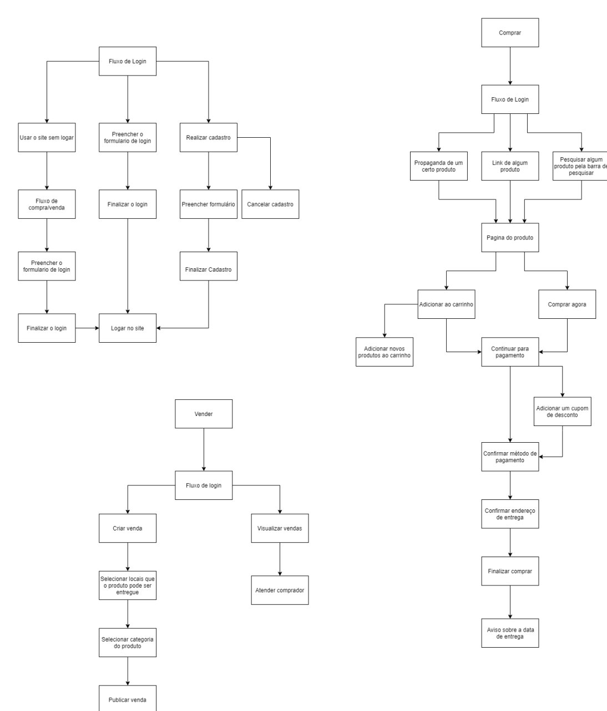

# Análise de Tarefas
## Metodologia
A análise de tarefas consiste em compreender sobre o trabalho dos usuários, ou seja, como e por qual motivo é realizado determinado trabalho. É com ele que determinam-se as etapas que deverão ser executadas dependendo da escolha que o usuário fez ou da tarefa que ele desempenhará em determinado software.

## Versão 1 - Análise de Tarefas

|Data|Versão|Descrição|Autor|
|:-:|:-:|:-:|:-:|
|02/10/2020|0.1|Criação do documento| Pedro Vítor de Salles Cella|