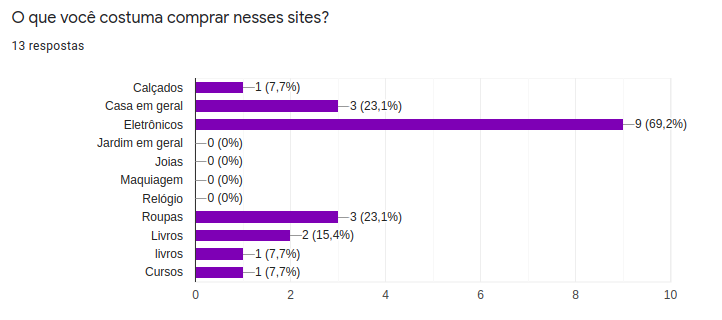
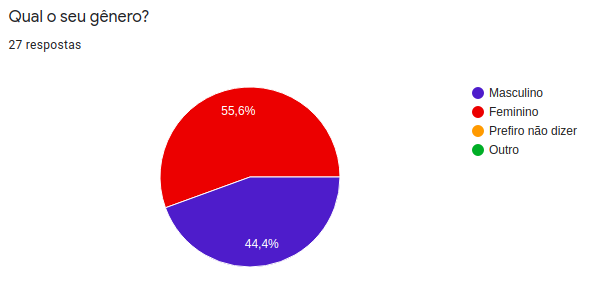

# Perfil de usuário
## Metodologia
Para traçar as características dos usuários e definir personas a partir das informações observadas, foi realizado dois questionários, um aplicado na comunidade acadêmica da Universidade de Brasiĺia e o outro aplicado para o público geral. Dessa forma, ao observar as informações coletadas, conseguimos desenvolver um estudo inicial para a elaboração do perfil do usuário.
 
## Público universitário
### Perfil demográfico
#### Gênero

#### Idade

#### Situação financeira

#### Ocupação

 
- Maioria masculino.
- Com faixa de idade entre 18-22 anos.
- Dependente de um terceiro.
- Com maioria fazendo, apenas, a faculdade.
 
### Interesses
#### Atividades realizadas com mais frequência na internet

#### Frequência de compras online

#### Categoria de produtos mais comprados

 
## Público geral
### Perfil demográfico
#### Gênero

#### Idade

#### Nível de escolaridade

#### Situação financeira

#### Ocupação

#### Renda familiar

 
- Maioria feminino.
- Com faixa de idade bem variada, mas com maioria entre 23-26 anos.
- A maioria possui ensino superior completo, porém tem uma grande parcela que possui superior incompleto.
- Independente de terceiros.
- Possuem um emprego e uma grande parcela também faz faculdade.
- A maioria possui renda familiar entre 3-6 salários mínimos.
 
### Interesses
#### Atividades realizadas com mais frequência na internet

#### Frequência de compras online

#### Categoria de produtos mais comprados

 
 
|Data|Versão|Descrição|Autor|
|:-:|:-:|:-:|:-:|
|01/10/2020|0.1|Criação do documento|Danillo Souza|
 
